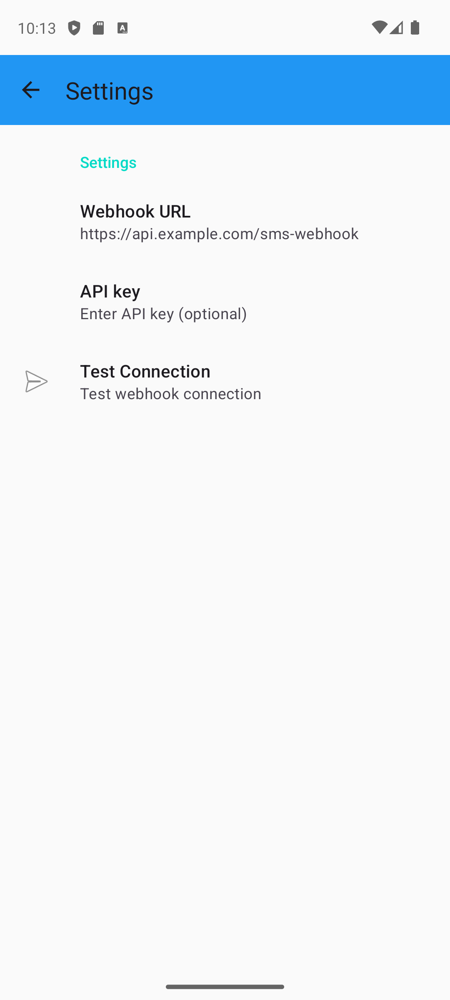
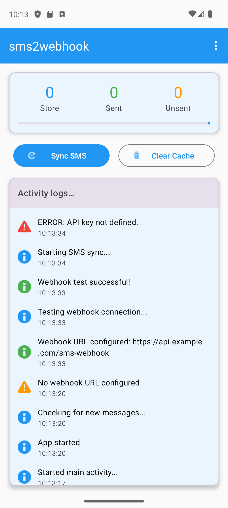

# SMS2Webhook

[](https://github.com/rossigee/sms2webhook/releases)
[](https://github.com/rossigee/sms2webhook/actions)
[](LICENSE)
[](https://www.android.com)
[](https://android-arsenal.com/api?level=28)

A modern Android app that forwards SMS messages to a webhook endpoint in real-time. Perfect for integrating SMS functionality into your applications, automation workflows, or archiving messages to your own server.

## Features

- 📱 **Real-time SMS forwarding** - Instantly sends incoming SMS to your webhook
- 📤 **Bulk sync** - Upload your entire SMS history with one tap
- 🔄 **Reliable delivery** - Automatic retries with exponential backoff
- 🔒 **Secure** - Supports API key authentication
- 📊 **Progress tracking** - Visual statistics and activity logs
- 🎨 **Modern UI** - Material Design 3 with dark mode support
- ⚡ **Efficient** - Prevents duplicate uploads with smart caching

## Screenshots

<div align="center">
  
  
</div>

## How It Works

1. **Configure your webhook** - Enter your server's webhook URL and optional API key
2. **Grant SMS permissions** - Allow the app to read SMS messages
3. **Automatic forwarding** - New messages are sent to your webhook instantly
4. **Sync existing messages** - Optionally upload your SMS history

## Webhook Format

The app sends a JSON payload to your webhook endpoint:

```json
{
  "_id": "2",
  "thread_id": "2",
  "address": "6505551212",
  "date": 1724154171042,
  "date_sent": 1724154170000,
  "protocol": "0",
  "read": "0",
  "status": "-1",
  "type": "1",
  "reply_path_present": "0",
  "body": "This is the message body",
  "locked": "0",
  "sub_id": "1",
  "error_code": "0",
  "creator": "com.google.android.apps.messaging",
  "seen": "1"
}
```

### Authentication

If you configure an API key in the app settings, it will be sent as an HTTP header:
```
Authorization: Bearer your-api-key
```

The API key is NOT included in the JSON payload itself.

## Installation

### Option 1: Download APK
Download the latest APK from the [Releases](https://github.com/rossigee/sms2webhook/releases) page and install it on your Android device.

### Option 2: Build from Source
```bash
# Clone the repository
git clone https://github.com/rossigee/sms2webhook.git
cd sms2webhook

# Build the APK (requires Java 17)
export JAVA_HOME=/usr/lib/jvm/java-17-openjdk-amd64
./gradlew assembleDebug

# Install on connected device
./gradlew installDebug
```

## Configuration

1. **Webhook URL**: Your server endpoint that will receive the SMS data
   - Example: `https://api.example.com/sms-webhook`
   - HTTPS recommended for security (HTTP supported for local testing)

2. **API Key** (optional): Add authentication to your webhook requests
   - Sent as `apiKey` field in the JSON payload
   - Useful for protecting your endpoint from unauthorized requests

3. **Test Connection**: Verify your webhook is working before syncing
   - Sends a test message to your endpoint
   - Shows success/failure in the activity log

## Use Cases

- 📊 **SMS Analytics** - Analyze messaging patterns and trends
- 🤖 **Automation** - Trigger workflows based on SMS content
- 💾 **Backup** - Archive messages to your own cloud storage
- 🔗 **Integration** - Connect SMS to CRM, ticketing, or notification systems
- 📱 **Multi-device** - Access SMS from multiple devices through your server

## Requirements

- Android 9.0 (API level 28) or higher
- SMS permissions (requested on first launch)
- Internet connection for webhook delivery

## Privacy & Security

- 🔒 All data transmission uses HTTPS (recommended)
- 📱 Messages are only sent to your configured webhook
- 💾 Local cache only stores message hashes, not content
- 🚫 No third-party servers or analytics
- ✅ Complete source code available for audit

## Troubleshooting

**Messages not sending?**
- Check your webhook URL is correct and accessible
- Verify internet connectivity
- Look at the activity log for error messages

**Duplicate messages?**
- The app prevents duplicates automatically
- Use "Clear Cache" if you need to re-sync everything

**Permission denied?**
- Go to Settings → Apps → SMS2Webhook → Permissions
- Enable SMS permission manually

## Contributing

Contributions are welcome! Please feel free to submit a Pull Request.

## License

This project is open source and available under the [MIT License](LICENSE).
