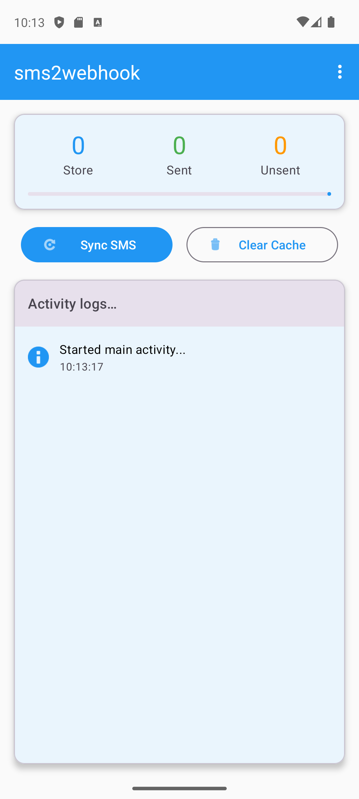
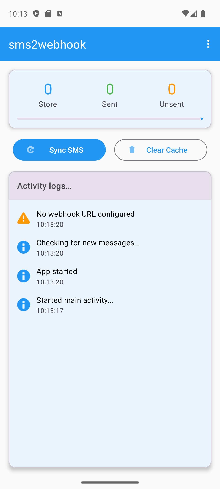
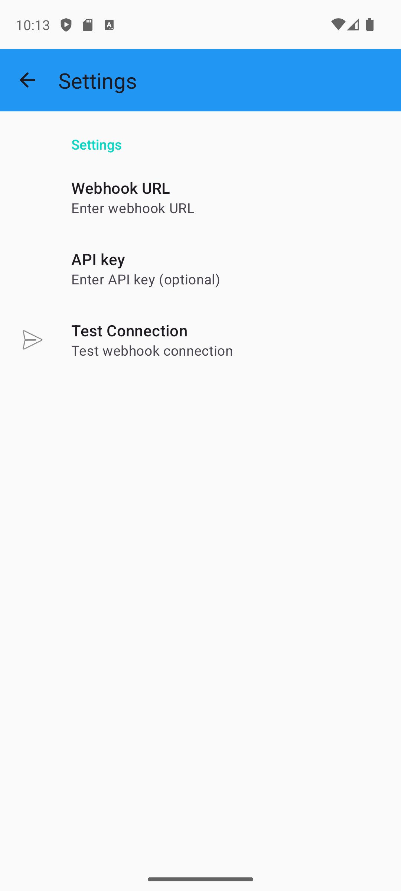

# sms2webhook

A simple Android app to dump SMS history to an HTTP webhook.

## Screenshots

<div align="center">
  
  
  
</div>

<div align="center">
  
  
</div>

The webhook sent looks something like this...

```json
{
  "_id": "2",
  "thread_id": "2",
  "address": "6505551212",
  "date": 1724154171042,
  "date_sent": 1724154170000,
  "protocol": "0",
  "read": "0",
  "status": "-1",
  "type": "1",
  "reply_path_present": "0",
  "body": "This is the message body",
  "locked": "0",
  "sub_id": "1",
  "error_code": "0",
  "creator": "com.google.android.apps.messaging",
  "seen": "1"
}
```
