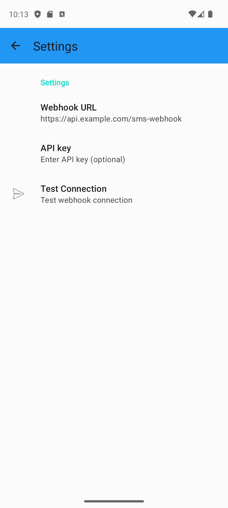
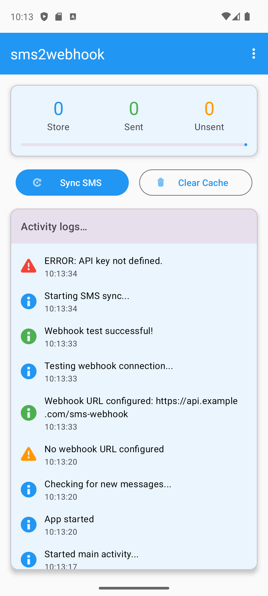

# SMS2Webhook

[](https://github.com/rossigee/sms2webhook/releases)
[](https://github.com/rossigee/sms2webhook/actions)
[](LICENSE)
[](https://www.android.com)
[](https://android-arsenal.com/api?level=28)

A modern Android app that forwards SMS messages to a webhook endpoint in real-time. Perfect for integrating SMS functionality into your applications, automation workflows, or archiving messages to your own server.

## Features

- 📱 **Real-time SMS forwarding** - Instantly sends incoming SMS to your webhook
- 📤 **Bulk sync** - Upload your entire SMS history with one tap
- 🔄 **Reliable delivery** - Automatic retries with exponential backoff
- 🔒 **Secure** - Supports API key authentication
- 📊 **Progress tracking** - Visual statistics and activity logs
- 🎨 **Modern UI** - Material Design 3 with dark mode support
- ⚡ **Efficient** - Prevents duplicate uploads with smart caching

## Screenshots

<div align="center">
  
  
</div>

## How It Works

1. **Configure your webhook** - Enter your server's webhook URL and optional API key
2. **Grant SMS permissions** - Allow the app to read SMS messages
3. **Automatic forwarding** - New messages are sent to your webhook instantly
4. **Sync existing messages** - Optionally upload the messages already in your inbox

## Webhook Format

The app sends a JSON payload to your webhook endpoint:

```json
{
  "_id": "2",
  "thread_id": "2",
  "address": "6505551212",
  "date": 1724154171042,
  "date_sent": 1724154170000,
  "protocol": "0",
  "read": "0",
  "status": "-1",
  "type": "1",
  "reply_path_present": "0",
  "body": "This is the message body",
  "locked": "0",
  "sub_id": "1",
  "error_code": "0",
  "creator": "com.google.android.apps.messaging",
  "seen": "1"
}
```

This is the phone's own messaging row, copied column by column, so the fields
present vary by device and Android version. Treat everything except these three as
optional, and guard the rest before reading them:

| Field | Why |
|---|---|
| `address` | The sender. Always present. |
| `body` | The message text. Always present. |
| `date` | When the message arrived, epoch milliseconds. Always present. |

`sub_id`, the SIM subscription a message arrived on, appears **only** where the
device's messaging app records one. Do not rely on it. Note also that every value
arrives as a JSON **string**, including the timestamps.

### Authentication

If you configure an API key in the app settings, it will be sent as an HTTP header:
```
Authorization: Bearer your-api-key
```

The API key is NOT included in the JSON payload itself.

### What the app does with your status code

This is the part that decides whether a message is ever delivered twice, so it
matters more than the payload shape.

| Your response | What the app does |
|---|---|
| **Any 2xx** | Delivered. Recorded, and never sent to you again. |
| **401, 404** | Held and retried. These mean the key or URL is wrong, which the user can fix, so the message stays queued. The sync stops at the first one rather than failing every message. |
| **408, 425, 429, any 5xx** | Held and retried. `Retry-After` is honoured if you send it. |
| **400, 403, 413, 422** | Treated as final. Recorded and **never retried** — the message is effectively discarded. |
| Connection failure | Held and retried. |

Two consequences worth designing around:

- **Return 2xx for success, not just 200.** `201` and `204` both count.
- **A 4xx other than 401/404 silently drops the message.** If your endpoint can
  fail validation in a way you would accept a retry for, answer `5xx` instead.

If you deduplicate server-side, return `200` with:

```
X-Already-Existed: true
```

The app surfaces that as "already on server, not stored again" rather than "uploaded".
It is informational — a `200` is accepted either way.

## Setup QR Codes

Settings → **Scan setup QR** fills in the webhook URL and API key from a QR code, for
pairing a phone with your server without typing either by hand. If you are building a
server that issues these codes, the format is one compact JSON object:

```json
{"v":1,"url":"https://your-host/sms/upload","key":"your-api-key","device":"Pixel 8"}
```

| Field | Required | Notes |
|---|---|---|
| `v` | yes | Must be exactly `1`. A missing version and a wrong version produce different errors, so a future format can be added without breaking older apps, and an older app refuses a newer one loudly. |
| `url` | yes | Must be `https://`. Cleartext is refused. |
| `key` | yes | Cannot be empty. Sent as `Authorization: Bearer`. There is no keyless QR pairing. |
| `device` | no | A label for your own UI. Ignored by the app. |

Unknown fields are ignored, and all values are trimmed before validation. A code is
rejected with a specific message when it is not JSON, has the wrong version, has no
URL, has a non-HTTPS or malformed URL, or has no key.

Two implementation notes:

- **QR codes are read with zxing-android-embedded**, so no companion app needs
  installing on the phone.
- The endpoint you point at is then treated as described under
  [What the app does with your status code](#what-the-app-does-with-your-status-code).
  Pairing a phone does not change any of those rules.

## Installation

### Option 1: Download APK
Download the latest APK from the [Releases](https://github.com/rossigee/sms2webhook/releases) page and install it on your Android device.

### Option 2: Build from Source
```bash
# Clone the repository
git clone https://github.com/rossigee/sms2webhook.git
cd sms2webhook

# Build the APK (requires Java 21)
export JAVA_HOME=/usr/lib/jvm/java-21-openjdk-amd64
./gradlew assembleDebug

# Install on connected device
./gradlew installDebug
```

## Configuration

1. **Webhook URL**: Your server endpoint that will receive the SMS data
   - Example: `https://api.example.com/sms-webhook`
   - HTTPS recommended for security (HTTP supported for local testing)

2. **API Key** (optional): Add authentication to your webhook requests
   - Sent as `apiKey` field in the JSON payload
   - Useful for protecting your endpoint from unauthorized requests

3. **Test Connection**: Verify your webhook is working before syncing
   - Sends a test message to your endpoint
   - Shows success/failure in the activity log

## Use Cases

- 📊 **SMS Analytics** - Analyze messaging patterns and trends
- 🤖 **Automation** - Trigger workflows based on SMS content
- 💾 **Backup** - Archive messages to your own cloud storage
- 🔗 **Integration** - Connect SMS to CRM, ticketing, or notification systems
- 📱 **Multi-device** - Access SMS from multiple devices through your server

## Requirements

- Android 9.0 (API level 28) or higher
- SMS permissions (requested on first launch)
- Internet connection for webhook delivery

## Privacy & Security

- 🔒 All data transmission uses HTTPS (recommended)
- 📱 Messages are only sent to your configured webhook
- 💾 Local cache only stores message hashes, not content
- 📦 App data is excluded from Android backup and device-to-device transfer, so the
  API key is not copied off the device
- 🚫 No third-party servers or analytics
- ✅ Complete source code available for audit

## Troubleshooting

**Messages not sending?**
- Check your webhook URL is correct and accessible
- Verify internet connectivity
- Look at the activity log for error messages

**Duplicate messages?**
- The app prevents duplicates automatically, and remembers messages your server
  refused rather than sending them again
- Clearing the cache in the menu **forgets that history, so the next sync re-sends
  everything**. Use it only if you intend that — duplicates are avoided only if your
  server recognises them.

**A message shows as "refused"?**
- The server answered with a 4xx that is not 401 or 404, and refused is treated as
  final, so it is not retried
- Check the activity log for the status code; a 401 or 404 means the API key or URL
  is wrong and *will* be retried once fixed

**Permission denied?**
- Go to Settings → Apps → SMS2Webhook → Permissions
- Enable SMS permission manually

## Contributing

Contributions are welcome! Please feel free to submit a Pull Request.

## License

This project is open source and available under the [MIT License](LICENSE).
